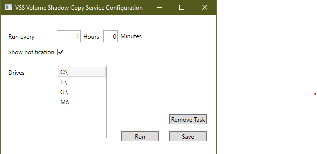

# VolumeSnapshotMaker
Generates volume snapshots on selected drives for Previous Versions

I have tried different backup solutions to restore indivual files, and while most of them work, I just love the simple implementation of "Previous Versions" that Volume Shadow Copy Services provides.

Unfortunately Windows 10 doesn't just support VSS out of the box. You can make a Scheduled Task that run it on interval, but I haven't been able to hide the window and it pops up in front and steal focus.

With this little tool you can easily schedule the creation of shadow copy's on all drives without seeing any notifications.

Drives, select the drives you want to create history for.
Run, runs a snapshot immediately.
Save, saves the current configuration and minimizes the app to the tray.
Remove Task, removes the app from "Task Scheduler".

On save the program will be scheduled to run the next time the current user logs in.